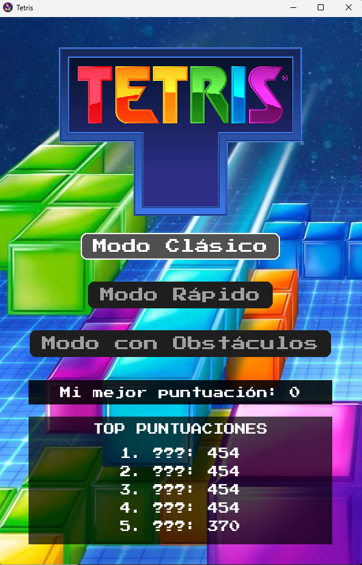
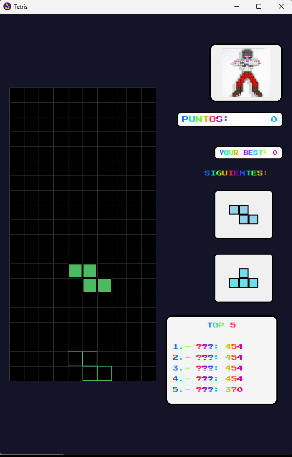
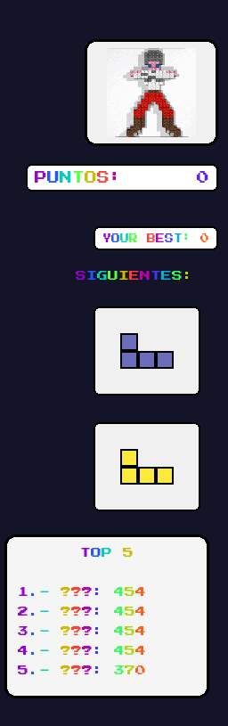
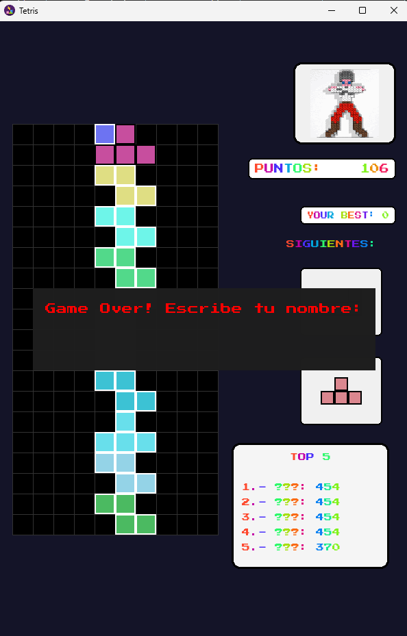

# Tetris casero

Este proyecto consiste en un Tetris desarrollado con la biblioteca de software libre **Pygame**.  
**Pygame** es una biblioteca orientada a la creación de videojuegos y aplicaciones multimedia interactivas utilizando el lenguaje de programación **Python**.

El juego cuenta con tres pantallas principales: **Inicio**, **Partida** y **Final**.

## 📑 Índice
- [▶️ Ejecutar proyecto](#️-ejecutar-proyecto)
- [⚙️ Crear el ejecutable (.exe)](#️-crear-el-ejecutable-exe)
- [🚀 Pantalla de Inicio](#-pantalla-de-inicio)
- [🎮 Pantalla de Juego](#-pantalla-de-juego)
- [🏁 Pantalla Final](#-pantalla-final)

---

## ▶️ Ejecutar proyecto

Sigue estos pasos para ejecutar el proyecto desde la terminal:

### 1. Instalar dependencias

Ejecuta el siguiente comando para instalar todas las dependencias necesarias:

```bash
pip install -r requirements.txt
```
### 2. Ejecutar el proyecto

Una vez instaladas las dependencias, ejecuta el archivo principal:

```bash 
python main.py
```
💡 En sistemas tipo Unix (Linux/Mac) también puedes usar:
```bash 
./main.py
```
Asegúrate de que el archivo tenga permisos de ejecución (chmod +x main.py).


## ⚙️ Crear el ejecutable (.exe)

Sigue estos pasos para generar un ejecutable de la aplicación:

### 1. Instalar dependencias

Instala las dependencias necesarias (si aún no lo hiciste):

```bash
pip install -r requirements.txt

```
### 2. Generar el ejecutable

Usa **PyInstaller** para crear el archivo .exe:

```bash
    pyinstaller --onefile --windowed --icon=icon_tetris.ico --add-data "imagenes;imagenes" --add-data "other;other" main.py
```
📁 El ejecutable se generará automáticamente dentro de la carpeta dist/.

## 🚀 Pantalla de Inicio

En la pantalla de **inicio** se muestran los modos de juego disponibles:

- **Modo Normal**  
- **Modo Rápido**  
- **Modo Obstáculos**

Además, se muestra:

- El **ranking** con las 5 mejores puntuaciones obtenidas en cualquiera de los modos.
- La **mejor puntuación personal** lograda en la versión actual del juego.



Para seleccionar un modo de juego utiliza las teclas:

- **↑ (arriba)** y **↓ (abajo)** para desplazarte entre los modos.
- **Enter** para confirmar la selección.


## 🎮 Pantalla de Juego

Una vez elegido el modo, aparecerá la pantalla principal de juego:



La interfaz se divide en dos partes:

- **Izquierda**: el tablero donde se desarrolla el Tetris.
- **Derecha**: información detallada de la partida actual.

### Controles

- **↑ (UP)**: Rotar la pieza.  
- **↓ (DOWN)**: Bajar más rápido la pieza (útil para ganar más puntos).  
- **← (LEFT)**: Mover la pieza a la izquierda.  
- **→ (RIGHT)**: Mover la pieza a la derecha.  

### Información mostrada



- Una **animación** que aparece al eliminar líneas.
- **Puntuación actual** de la partida.
- **Mejor puntuación personal** alcanzada.
- Las **2 siguientes piezas** que aparecerán.
- El **Top 5** de puntuaciones (con las 3 iniciales de cada jugador).

## 🏁 Pantalla Final

Cuando ya no se puedan colocar más piezas, aparecerá la pantalla final:



Aquí deberás **introducir tu nombre** para guardar la puntuación obtenida.  
Presiona **Enter** para confirmar.

- Si no introduces ningún nombre o decides salir, no se guardará la puntuación y volverás al menú principal.
- Es posible que existan varias puntuaciones almacenadas con el mismo nombre.
